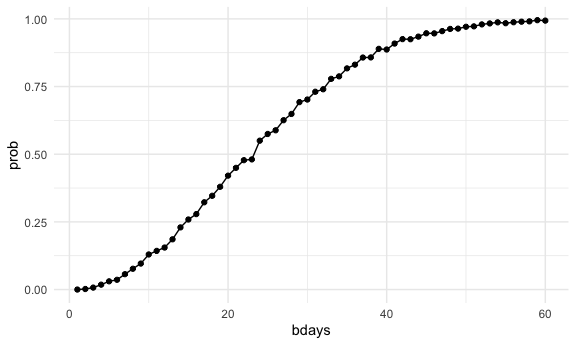

p8105_hw5_sc5826
================
Shivalika Chavan
2025-10-30

## Problem 1

``` r
birthdays = sample(1:365, 50, replace = TRUE)

repeated_bday = length(unique(birthdays)) < 50

repeated_bday
```

    ## [1] TRUE

``` r
bday_sim = function(n_room){
  
  birthdays = sample(1:365, n_room, replace = TRUE)

  repeated_bday = length(unique(birthdays)) < n_room
  
  repeated_bday
}
```

``` r
bday_sim_results = 
  expand_grid(
    bdays = 1:60,
    iter = 1:2500
  ) |> 
  mutate(
    results = map_lgl(bdays, bday_sim)
  ) |> 
  group_by(bdays) |> 
  summarize(
    prob = mean(results)
  ) 

bday_sim_results|> 
  ggplot(aes(x = bdays, y = prob)) +
  geom_point() + geom_line()
```


