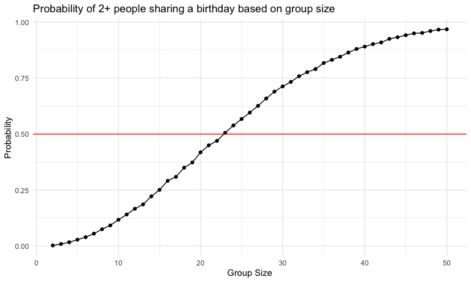
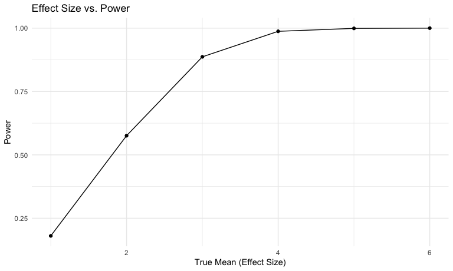
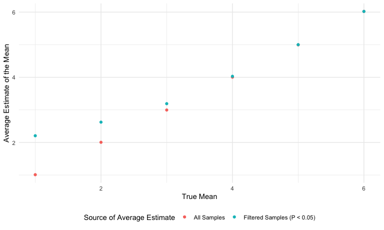
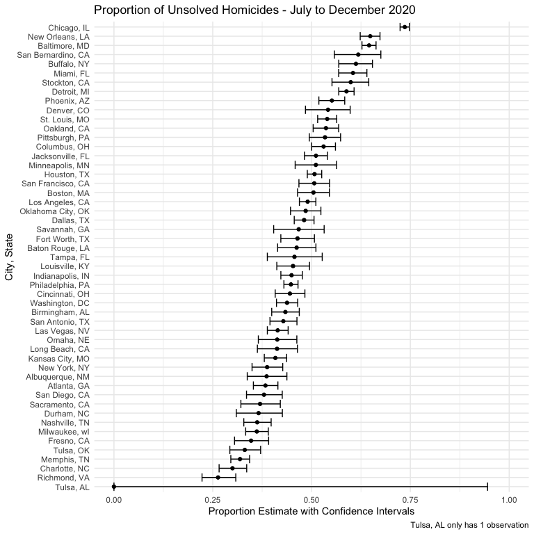

p8105_hw5_sc5826
================
Shivalika Chavan
2025-10-30

## Problem 1

``` r
bday_sim_results = 
  expand_grid(
    group_size = 2:50,
    iter = 1:10000
  ) |> 
  mutate(
    results = map_lgl(group_size, bday_sim)
  ) |> 
  group_by(group_size) |> 
  summarize(
    probability = mean(results)
  )

bday_sim_results
## # A tibble: 49 × 2
##    group_size probability
##         <int>       <dbl>
##  1          2      0.0028
##  2          3      0.008 
##  3          4      0.0169
##  4          5      0.0237
##  5          6      0.0393
##  6          7      0.0596
##  7          8      0.0771
##  8          9      0.0941
##  9         10      0.119 
## 10         11      0.137 
## # ℹ 39 more rows
```

``` r
bday_sim_results|> 
  ggplot(aes(x = group_size, y = probability)) +
  geom_point() + 
  geom_line() + 
  geom_hline(yintercept = 0.5, color = "red") + 
  xlab("Group Size") +
  ylab("Probability") + 
  labs(
    title = "Probability of 2+ people sharing a birthday based on group size"
  ) 
```



The resulting curve is S-shaped, where the probability begins to taper
around a group size of 50. At a group size of 2, the probability of at
least 2 people sharing a birthday is 0.003. At a group size of 50, the
probability of at least 2 people sharing a birthday is 0.971. To have
more than a 50% probability of at least 2 people sharing a birthday, the
group size needs to be at least 23.

## Problem 2

Setting design parameters

``` r
n = 30
sigma = 5
mu = 0
n_datasets = 5000
alpha = 0.05
```

Running simulation for 𝜇 = 0:

``` r
normal_dist_sim_mu_0 = 
  expand_grid(
    mean = mu,
    iter = 1:n_datasets
  ) |> 
  mutate(
    results = map(mean, normal_distribution_sim)
  ) |> 
  unnest(results)
normal_dist_sim_mu_0
## # A tibble: 5,000 × 4
##     mean  iter  mu_hat p.value
##    <dbl> <int>   <dbl>   <dbl>
##  1     0     1  0.0339  0.974 
##  2     0     2 -0.103   0.902 
##  3     0     3 -0.197   0.814 
##  4     0     4 -1.02    0.353 
##  5     0     5  0.678   0.440 
##  6     0     6 -0.462   0.640 
##  7     0     7  1.57    0.0992
##  8     0     8 -1.06    0.321 
##  9     0     9  0.198   0.808 
## 10     0    10  0.0408  0.960 
## # ℹ 4,990 more rows
```

Repeating simulation for 𝜇 in {1, 2, 3, 4, 5, 6}:

``` r
normal_dist_sim = 
  expand_grid(
    mean = 1:6,
    iter = 1:n_datasets
  ) |> 
  mutate(
    results = map(mean, normal_distribution_sim)
  ) |> 
  unnest(results)
normal_dist_sim
## # A tibble: 30,000 × 4
##     mean  iter mu_hat p.value
##    <int> <int>  <dbl>   <dbl>
##  1     1     1  0.628  0.472 
##  2     1     2  2.08   0.0140
##  3     1     3  1.69   0.0440
##  4     1     4  0.251  0.799 
##  5     1     5  1.21   0.220 
##  6     1     6  2.62   0.0101
##  7     1     7 -0.234  0.775 
##  8     1     8  2.37   0.0490
##  9     1     9 -0.657  0.430 
## 10     1    10  0.765  0.432 
## # ℹ 29,990 more rows
```

Plotting effect size vs. power

``` r
normal_dist_sim |> 
  group_by(mean) |> 
  summarize(
    power = sum(p.value < alpha) / n()
  ) |> 
  ggplot(aes(x = mean, y = power)) + 
  geom_point() +
  geom_line() + 
  xlab("True Mean (Effect Size)") + 
  ylab("Power") + 
  labs(
    title = "Effect Size vs. Power"
  ) 
```



There is an overall positive correlation between effect size and power.
When effect sizes are very small (\< 2), power is low. This means the
null hypothesis (𝜇 = 0) is failing to be rejected more often. At larger
effect sizes (\> 4), power is nearly 1. This means the null hypothesis
(𝜇 = 0) is being rejected nearly every time.

``` r
avg_estimates = 
  normal_dist_sim |> 
  group_by(mean) |> 
  summarize(avg_mu_hat = mean(mu_hat), n = n()) |> 
  mutate(estimates_source = "All Samples")

avg_estimates_null_rejected = normal_dist_sim |> 
  filter(p.value < 0.05) |> 
  group_by(mean) |> 
  summarize(avg_mu_hat = mean(mu_hat), n = n()) |> 
  mutate(estimates_source = "Filtered Samples (P < 0.05)")

rbind(avg_estimates, avg_estimates_null_rejected) |> 
  ggplot(aes(x = mean, y = avg_mu_hat, color = estimates_source)) + 
  geom_point() + 
  xlab("True Mean") + 
  ylab("Average Estimate of the Mean") + 
  labs(
    color = "Source of Average Estimate"
  )
```



The sample average of mû across tests for which the null is rejected is
only approximately equal to the true value of 𝜇 at larger effect sizes
(\> 4). These larger effect sizes are also the ones at which power is
nearly 1. As seen in the table below, as effect size increases, more
tests result in rejecting the null hypothesis. Filtering for the tests
where the p-value \< 0.05, means that we are only selecting samples that
are very extreme (since p-value means the probability of seeing a result
as extreme or more extreme than the result). When there is low power and
a small effect size, many tests will fail to reject the null hypothesis,
even if the data set is correctly estimating the true mean. This is also
seen in the table below, where there is a larger difference between
“avg_mu_hat_All Samples” and “avg_mu_hat_Filtered Samples (P \< 0.05)”
at smaller effect sizes.

``` r
rbind(avg_estimates, avg_estimates_null_rejected) |> 
  pivot_wider(
    names_from = estimates_source,
    values_from = c(avg_mu_hat, n)
  ) |> 
  knitr::kable()
```

| mean | avg_mu_hat_All Samples | avg_mu_hat_Filtered Samples (P \< 0.05) | n_All Samples | n_Filtered Samples (P \< 0.05) |
|---:|---:|---:|---:|---:|
| 1 | 1.010003 | 2.206044 | 5000 | 931 |
| 2 | 2.004929 | 2.623367 | 5000 | 2798 |
| 3 | 2.996076 | 3.189938 | 5000 | 4434 |
| 4 | 4.004333 | 4.031122 | 5000 | 4942 |
| 5 | 4.996487 | 5.001569 | 5000 | 4992 |
| 6 | 6.022193 | 6.022193 | 5000 | 5000 |

## Problem 3

``` r
homicide_data = read.csv("./data/homicide-data.csv") |> 
  janitor::clean_names() |> 
  mutate(
    reported_date = as.Date(as.character(reported_date), format = "%y%m%d")
  )
```

There are 52179 observations in the `homicide_data` data set from the
Washington Post. Each homicide is noted by a unique identifier `uid`.
These homicides range from July 01, 2020 to December 12, 2020, though
about 49.6% of reported homicides have no `reported_date`. In most
homicides, there is information about the homicide victim like the name
(`last` and `first`) and demographic (`race`, `age`, and`sex`), the
location of the homicide (`city` and `state` as well as `lat` and
`long`), and disposition of the case (`Closed without arrest`,
`Closed by arrest`, or `Open/No arrest`).

``` r
homicide_data = 
  homicide_data |> 
  mutate(
    city_state = paste0(city, ", ", state)
  )
```

``` r
homicide_data |> 
  filter(disposition != "Closed by arrest") |> 
  group_by(city_state) |> 
  summarize(unsolved_homicides = n()) |> 
  knitr::kable()
```

| city_state         | unsolved_homicides |
|:-------------------|-------------------:|
| Albuquerque, NM    |                146 |
| Atlanta, GA        |                373 |
| Baltimore, MD      |               1825 |
| Baton Rouge, LA    |                196 |
| Birmingham, AL     |                347 |
| Boston, MA         |                310 |
| Buffalo, NY        |                319 |
| Charlotte, NC      |                206 |
| Chicago, IL        |               4073 |
| Cincinnati, OH     |                309 |
| Columbus, OH       |                575 |
| Dallas, TX         |                754 |
| Denver, CO         |                169 |
| Detroit, MI        |               1482 |
| Durham, NC         |                101 |
| Fort Worth, TX     |                255 |
| Fresno, CA         |                169 |
| Houston, TX        |               1493 |
| Indianapolis, IN   |                594 |
| Jacksonville, FL   |                597 |
| Kansas City, MO    |                486 |
| Las Vegas, NV      |                572 |
| Long Beach, CA     |                156 |
| Los Angeles, CA    |               1106 |
| Louisville, KY     |                261 |
| Memphis, TN        |                483 |
| Miami, FL          |                450 |
| Milwaukee, wI      |                403 |
| Minneapolis, MN    |                187 |
| Nashville, TN      |                278 |
| New Orleans, LA    |                930 |
| New York, NY       |                243 |
| Oakland, CA        |                508 |
| Oklahoma City, OK  |                326 |
| Omaha, NE          |                169 |
| Philadelphia, PA   |               1360 |
| Phoenix, AZ        |                504 |
| Pittsburgh, PA     |                337 |
| Richmond, VA       |                113 |
| Sacramento, CA     |                139 |
| San Antonio, TX    |                357 |
| San Bernardino, CA |                170 |
| San Diego, CA      |                175 |
| San Francisco, CA  |                336 |
| Savannah, GA       |                115 |
| St. Louis, MO      |                905 |
| Stockton, CA       |                266 |
| Tampa, FL          |                 95 |
| Tulsa, OK          |                193 |
| Washington, DC     |                589 |

``` r
prop_test_unsolved_homicides_result = 
  homicide_data |> 
  filter(city_state == "Baltimore, MD") |> 
  summarize(
    num_unsolved_homicides = sum(disposition != "Closed by arrest"),
    num_homicides = n()
  ) |> 
  with(prop.test(x = num_unsolved_homicides, n = num_homicides))

prop_test_unsolved_homicides_result
## 
##  1-sample proportions test with continuity correction
## 
## data:  num_unsolved_homicides out of num_homicides, null probability 0.5
## X-squared = 239.01, df = 1, p-value < 2.2e-16
## alternative hypothesis: true p is not equal to 0.5
## 95 percent confidence interval:
##  0.6275625 0.6631599
## sample estimates:
##         p 
## 0.6455607

prop_test_unsolved_homicides_result |> 
  broom::tidy() |> 
  select(estimate, conf.low, conf.high) |> 
  knitr::kable()
```

|  estimate |  conf.low | conf.high |
|----------:|----------:|----------:|
| 0.6455607 | 0.6275625 | 0.6631599 |

``` r
prop_tests_results = 
  homicide_data |> 
  group_by(city_state,) |> 
  summarize(
    num_unsolved_homicides = sum(disposition != "Closed by arrest"),
    num_homicides = n()
  ) |> 
  mutate(
    prop_test = map2(num_unsolved_homicides, num_homicides, prop.test),
    results = map(prop_test, broom::tidy)
  ) |> 
  unnest(results) |> 
  select(city_state, estimate, conf.low, conf.high)
## Warning: There was 1 warning in `mutate()`.
## ℹ In argument: `prop_test = map2(num_unsolved_homicides, num_homicides,
##   prop.test)`.
## Caused by warning in `.f()`:
## ! Chi-squared approximation may be incorrect
  
prop_tests_results |> 
  knitr::kable(digits = 3)
```

| city_state         | estimate | conf.low | conf.high |
|:-------------------|---------:|---------:|----------:|
| Albuquerque, NM    |    0.386 |    0.337 |     0.438 |
| Atlanta, GA        |    0.383 |    0.353 |     0.415 |
| Baltimore, MD      |    0.646 |    0.628 |     0.663 |
| Baton Rouge, LA    |    0.462 |    0.414 |     0.511 |
| Birmingham, AL     |    0.434 |    0.399 |     0.469 |
| Boston, MA         |    0.505 |    0.465 |     0.545 |
| Buffalo, NY        |    0.612 |    0.569 |     0.654 |
| Charlotte, NC      |    0.300 |    0.266 |     0.336 |
| Chicago, IL        |    0.736 |    0.724 |     0.747 |
| Cincinnati, OH     |    0.445 |    0.408 |     0.483 |
| Columbus, OH       |    0.530 |    0.500 |     0.560 |
| Dallas, TX         |    0.481 |    0.456 |     0.506 |
| Denver, CO         |    0.542 |    0.485 |     0.598 |
| Detroit, MI        |    0.588 |    0.569 |     0.608 |
| Durham, NC         |    0.366 |    0.310 |     0.426 |
| Fort Worth, TX     |    0.464 |    0.422 |     0.507 |
| Fresno, CA         |    0.347 |    0.305 |     0.391 |
| Houston, TX        |    0.507 |    0.489 |     0.526 |
| Indianapolis, IN   |    0.449 |    0.422 |     0.477 |
| Jacksonville, FL   |    0.511 |    0.482 |     0.540 |
| Kansas City, MO    |    0.408 |    0.380 |     0.437 |
| Las Vegas, NV      |    0.414 |    0.388 |     0.441 |
| Long Beach, CA     |    0.413 |    0.363 |     0.464 |
| Los Angeles, CA    |    0.490 |    0.469 |     0.511 |
| Louisville, KY     |    0.453 |    0.412 |     0.495 |
| Memphis, TN        |    0.319 |    0.296 |     0.343 |
| Miami, FL          |    0.605 |    0.569 |     0.640 |
| Milwaukee, wI      |    0.361 |    0.333 |     0.391 |
| Minneapolis, MN    |    0.511 |    0.459 |     0.563 |
| Nashville, TN      |    0.362 |    0.329 |     0.398 |
| New Orleans, LA    |    0.649 |    0.623 |     0.673 |
| New York, NY       |    0.388 |    0.349 |     0.427 |
| Oakland, CA        |    0.536 |    0.504 |     0.569 |
| Oklahoma City, OK  |    0.485 |    0.447 |     0.524 |
| Omaha, NE          |    0.413 |    0.365 |     0.463 |
| Philadelphia, PA   |    0.448 |    0.430 |     0.466 |
| Phoenix, AZ        |    0.551 |    0.518 |     0.584 |
| Pittsburgh, PA     |    0.534 |    0.494 |     0.573 |
| Richmond, VA       |    0.263 |    0.223 |     0.308 |
| Sacramento, CA     |    0.370 |    0.321 |     0.421 |
| San Antonio, TX    |    0.429 |    0.395 |     0.463 |
| San Bernardino, CA |    0.618 |    0.558 |     0.675 |
| San Diego, CA      |    0.380 |    0.335 |     0.426 |
| San Francisco, CA  |    0.507 |    0.468 |     0.545 |
| Savannah, GA       |    0.467 |    0.404 |     0.532 |
| St. Louis, MO      |    0.540 |    0.515 |     0.564 |
| Stockton, CA       |    0.599 |    0.552 |     0.645 |
| Tampa, FL          |    0.457 |    0.388 |     0.527 |
| Tulsa, AL          |    0.000 |    0.000 |     0.945 |
| Tulsa, OK          |    0.331 |    0.293 |     0.371 |
| Washington, DC     |    0.438 |    0.411 |     0.465 |

``` r
prop_tests_results |> 
  mutate(city_state = fct_reorder(city_state, estimate)) |> 
  ggplot(aes(x = city_state, y = estimate)) + 
  geom_point() + 
  geom_errorbar(aes(ymin = conf.low, ymax = conf.high)) +
  theme(
    axis.text.x = element_text(angle=45, hjust=1)
  ) +
  xlab("City, State") +
  ylab("Proportion with Confidence Intervals") + 
  labs(
    title = "Proportion of Unsolved Homicides - July to December 2020"
  )
```


