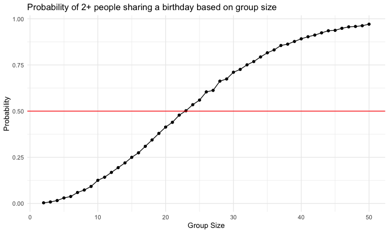

p8105_hw5_sc5826
================
Shivalika Chavan
2025-10-30

## Problem 1

``` r
bday_sim_results = 
  expand_grid(
    group_size = 2:50,
    iter = 1:10000
  ) |> 
  mutate(
    results = map_lgl(group_size, bday_sim)
  ) |> 
  group_by(group_size) |> 
  summarize(
    probability = mean(results)
  )
```

``` r
bday_sim_results|> 
  ggplot(aes(x = group_size, y = probability)) +
  geom_point() + 
  geom_line() + 
  geom_hline(yintercept = 0.5, color = "red") + 
  xlab("Group Size") +
  ylab("Probability") + 
  labs(
    title = "Probability of 2+ people sharing a birthday based on group size"
  ) 
```



The resulting curve is S-shaped, where the probability begins to taper
around a group size of 50. At a group size of 2, the probability of at
least 2 people sharing a birthday is 0.004. At a group size of 50, the
probability of at least 2 people sharing a birthday is 0.971. To have
more than a 50% probability of at least 2 people sharing a birthday, the
group size needs to be at least 23.
